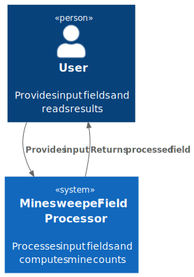

# 3. System Scope and Context

## 3.1 System Scope

The Minesweeper Field Processor is a single console application. It has no external system dependencies — all interaction is through stdin and stdout.

## 3.2 Context Diagram

## 3.3 External Interfaces

| Interface | Direction | Description |
|-----------|-----------|-------------|
| stdin | Input | One or more minesweeper fields in the defined text format, terminated by `0 0`. |
| stdout | Output | Annotated fields printed in the defined text format, one per `Field #N:` block. |

There are no other external systems, networks, databases, or services involved.
