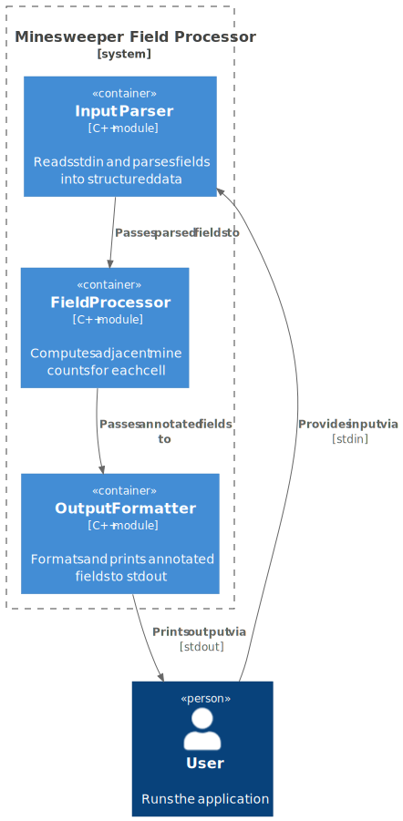
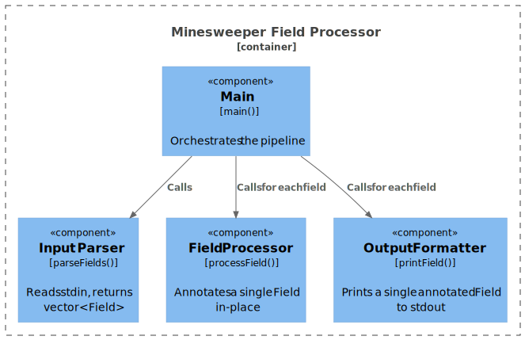

# 5. Building Block View

## 5.1 Container Diagram



## 5.2 Component Descriptions

| Component | Responsibility |
|-----------|---------------|
| Input Parser | Reads lines from stdin, groups them into `Field` structs (dimensions + grid rows), stops on `0 0`. |
| Field Processor | For each field, replaces each `.` cell with the count of adjacent `*` cells (8-directional). |
| Output Formatter | Prints `Field #N:` header followed by the annotated grid; separates fields with a blank line. |

## 5.3 Data Structure

The single shared data structure passed between components:

```cpp
struct Field {
    int rows, cols;
    vector<string> grid; // rows x cols, cells are '.' or '*'
};
```

## 5.4 Component Diagram


