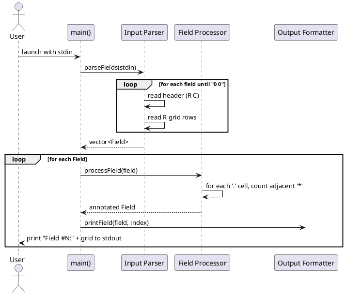
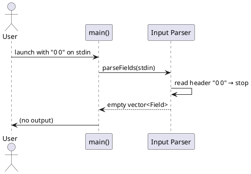

# 6. Runtime View

## 6.1 Main Processing Scenario

The primary runtime scenario: user pipes a file with multiple fields into the application.

## 6.2 Edge Case: Empty Input

If stdin contains only `0 0`, the parser returns an empty vector and no output is produced.

