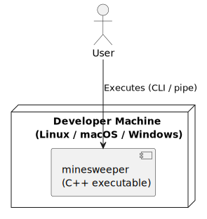

# 7. Deployment View

## 7.1 Overview

The Minesweeper Field Processor is a single compiled binary. There is no deployment infrastructure — the user compiles and runs it locally.

## 7.2 Deployment Diagram

## 7.3 Build and Run

| Step | Command |
|------|---------|
| Compile | `g++ -std=c++17 -o minesweeper main.cpp` |
| Run with file | `./minesweeper < input.txt` |
| Run interactive | `./minesweeper` (type input manually) |

No external dependencies, libraries, or runtime environment beyond a standard C++17 compiler.
